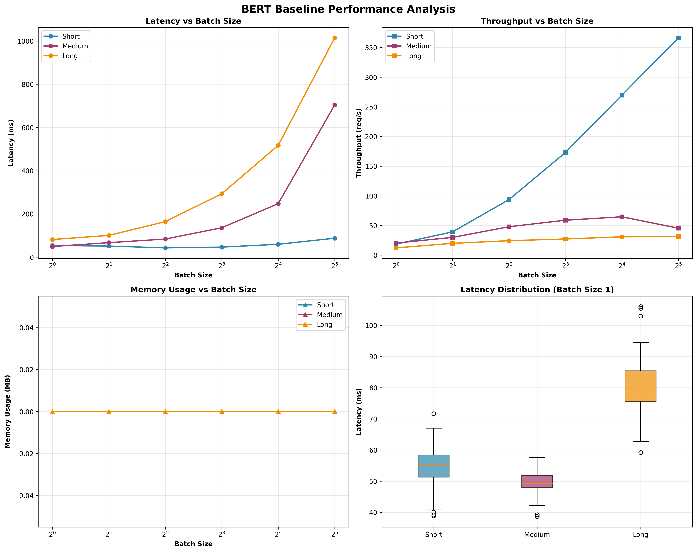

# BERT Baseline Performance Report

**Generated:** 2025-09-04 10:21:55

## System Configuration

- **Model:** bert-base-uncased
- **Device:** cpu
- **PyTorch Version:** 2.8.0
- **Transformers Version:** 4.56.0
- **CUDA Available:** False
- **Measurement Runs:** 50
- **Warmup Runs:** 10

## Performance Analysis

## Performance Results

### Short Text Performance

| Batch Size | Mean Latency (ms) | P95 Latency (ms) | P99 Latency (ms) | Throughput (req/s) | GPU Memory (MB) |
|------------|-------------------|------------------|------------------|-------------------|------------------|
| 1 | 59.06 | 61.74 | 67.52 | 16.9 | 0.0 |
| 2 | 57.60 | 60.88 | 61.62 | 34.7 | 0.0 |
| 4 | 49.86 | 56.33 | 56.81 | 80.2 | 0.0 |
| 8 | 59.99 | 70.21 | 70.23 | 133.4 | 0.0 |
| 16 | 71.22 | 74.57 | 75.01 | 224.7 | 0.0 |
| 32 | 100.11 | 100.11 | 100.11 | 319.6 | 0.0 |

### Medium Text Performance

| Batch Size | Mean Latency (ms) | P95 Latency (ms) | P99 Latency (ms) | Throughput (req/s) | GPU Memory (MB) |
|------------|-------------------|------------------|------------------|-------------------|------------------|
| 1 | 54.07 | 57.99 | 60.29 | 18.5 | 0.0 |
| 2 | 71.07 | 75.24 | 79.33 | 28.1 | 0.0 |
| 4 | 97.43 | 103.10 | 106.56 | 41.1 | 0.0 |
| 8 | 161.95 | 163.90 | 164.07 | 49.4 | 0.0 |
| 16 | 273.77 | 280.03 | 280.56 | 58.4 | 0.0 |
| 32 | 519.61 | 519.61 | 519.61 | 61.6 | 0.0 |

### Long Text Performance

| Batch Size | Mean Latency (ms) | P95 Latency (ms) | P99 Latency (ms) | Throughput (req/s) | GPU Memory (MB) |
|------------|-------------------|------------------|------------------|-------------------|------------------|
| 1 | 86.32 | 90.07 | 95.12 | 11.6 | 0.0 |
| 2 | 119.99 | 125.52 | 125.94 | 16.7 | 0.0 |
| 4 | 209.41 | 234.59 | 239.86 | 19.1 | 0.0 |
| 8 | 281.89 | 287.98 | 288.23 | 28.4 | 0.0 |
| 16 | 632.76 | 647.76 | 649.10 | 25.3 | 0.0 |
| 32 | 1135.11 | 1135.11 | 1135.11 | 28.2 | 0.0 |

## Performance Summary

**Short Texts:**
- Best Latency: 49.86ms (batch size 4)
- Best Throughput: 319.6 req/s (batch size 32)
- Memory Range: 0.0 - 0.0 MB

**Medium Texts:**
- Best Latency: 54.07ms (batch size 1)
- Best Throughput: 61.6 req/s (batch size 32)
- Memory Range: 0.0 - 0.0 MB

**Long Texts:**
- Best Latency: 86.32ms (batch size 1)
- Best Throughput: 28.4 req/s (batch size 8)
- Memory Range: 0.0 - 0.0 MB

